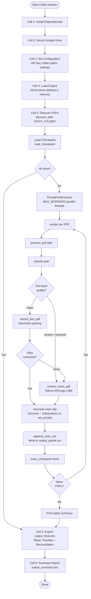
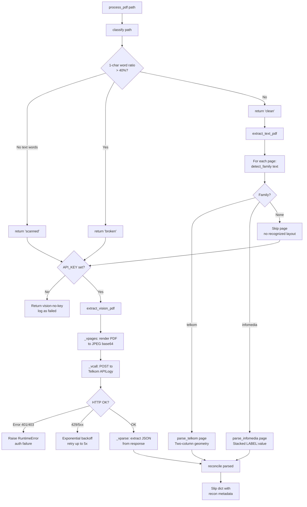
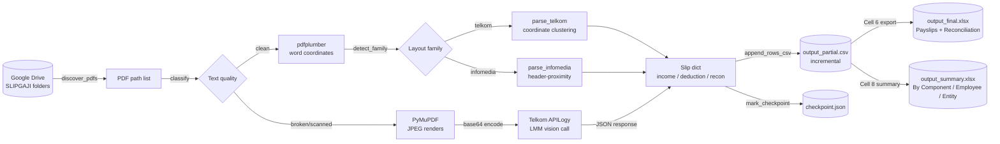

# Technical Documentation — Payslip Extractor (Audit Grade)

## 1. Overview

### Purpose
This notebook is a production-grade payslip processing pipeline built for **external financial audits**. It ingests hundreds of Indonesian employee payslip PDFs stored in Google Drive, extracts every line item verbatim, validates each extracted slip against its own printed totals, and produces structured Excel deliverables ready for auditor review.

### High-Level Summary
The pipeline was engineered around one hard constraint: **zero tolerance for fabricated or misread numbers**. To achieve this, it uses a two-path architecture:

- **Text path (deterministic):** For PDFs with an intact digital text layer, extraction is done entirely through geometric coordinate-based parsing — no AI involved. This path has been measured at 100% accuracy against a hand-certified gold standard of 191 line items across 11 representative templates.
- **Vision path (AI fallback):** For PDFs with corrupted text layers, heavy watermarks, or true scanned images, each page is rendered to JPEG and submitted to a large multimodal model (Telkom APILogy) with strict instructions to transcribe verbatim.

Both paths feed through the same **reconciliation gate**: every extracted slip's `Σ(earnings) − Σ(deductions)` is compared to the printed net pay figure. A mismatch flags the slip for human review; nothing is silently wrong.

### Main Capabilities
- Automated discovery of all payslip PDFs across 100+ employee folders
- Intelligent routing between deterministic and AI-based extraction
- Crash-safe incremental processing with checkpoint/resume
- Reconciliation-based quality control with ±1 IDR rounding tolerance
- Long-table output (one row per line item) in Excel with reconciliation summary
- Monthly summary report breaking down earnings, deductions, and net income by entity, employee, and payroll component

---

## 2. Overall Workflow

The execution follows a strict sequential order across 8 cells:

1. **Install dependencies** (Cell 1) — runs once per Colab session
2. **Mount Google Drive** (Cell 2) — attaches the shared Drive containing source PDFs and result folder
3. **Configure parameters** (Cell 3) — set API key, folder paths, performance settings
4. **Load the engine** (Cell 4) — defines all extraction and utility functions in memory
5. **Process PDFs** (Cell 5) — discover files, skip checkpointed ones, extract in parallel, write incrementally
6. **Export main Excel** (Cell 6) — build `output_final.xlsx` from the accumulated CSV
7. **Generate summary report** (Cell 8) — build `output_summary.xlsx` with monthly breakdowns
8. *(Cell 7 is a safety reset — normally kept commented out)*

---

## 3. Flow Diagram

### Main Pipeline



### Internal Extraction Routing



---

## 4. Project Architecture

The notebook is structured as a **self-contained single-file pipeline** — all logic lives in Cell 4. There are no external module imports beyond standard libraries and pip packages. This design choice makes the notebook portable: upload one file to Colab, run it.

### Major Components

| Component | Location | Responsibility |
|---|---|---|
| Configuration block | Cell 3 | All tunable parameters in one place |
| PDF classifier | `classify()` | Determines which extraction path to use |
| Entity detector | `detect_entity()` | Identifies the payroll provider from content and filename |
| Telkom parser | `parse_telkom()` + helpers | Geometric extraction for two-column layouts |
| INFOMEDIA parser | `parse_infomedia()` + helpers | Geometric extraction for stacked label:value layouts |
| Vision extractor | `extract_vision_pdf()` + helpers | AI-based extraction for unreadable PDFs |
| Reconciliation engine | `reconcile()` | Validates every slip against its own printed totals |
| Checkpoint system | `load_checkpoint()`, `mark_checkpoint()` | Crash-safe resume |
| Incremental writer | `append_rows_csv()` | Streams rows to disk after each PDF |
| PDF discovery | `discover_pdfs()` | Walks the Drive folder tree |
| Batch orchestrator | Cell 5 worker + `ThreadPoolExecutor` | Parallel processing with progress reporting |
| Excel exporter | Cell 6 | Builds the two-sheet audit deliverable |
| Summary reporter | Cell 8 | Monthly breakdowns across three aggregation levels |

---

## 5. Detailed Code Walkthrough

### 5.1 Configuration (Cell 3)

**Purpose:** Centralise every tunable parameter in a single cell so engineers do not need to touch any other cell for a new deployment.

**Key settings:**

| Variable | Example Value | Effect |
|---|---|---|
| `API_KEY` | `''` | Telkom APILogy authentication. Empty = vision path disabled |
| `API_URL` | `https://...` | Endpoint for the multimodal model |
| `MAX_TOKENS` | `2000` | Maximum tokens the model may return per page |
| `ROOT_FOLDER` | `/content/drive/...` | Top-level folder containing employee sub-folders |
| `RESULT_FOLDER` | `ROOT_FOLDER/_results_audit` | All output files land here |
| `MAX_WORKERS` | `3` | Number of PDFs processed simultaneously |
| `VISION_DPI` | `150` | Image resolution for vision rendering. Higher = clearer but larger |
| `VISION_JPEG_QUALITY` | `80` | JPEG compression quality for page images sent to the API |
| `VISION_MAX_WIDTH` | `1400` | Maximum pixel width; wider images are resized to cap request size |
| `VISION_RETRIES` | `5` | Maximum retry attempts on API failure |
| `VISION_BACKOFF_BASE` | `2` | Base for exponential back-off: `2^attempt` seconds |
| `VISION_BACKOFF_MAX` | `60` | Maximum back-off wait in seconds |

**Output files created:**

| Variable | Filename | Description |
|---|---|---|
| `CHECKPOINT_FILE` | `checkpoint.json` | Progress tracker: `{abs_path: "done"/"failed"}` |
| `FAILED_CSV` | `failed_files.csv` | Every failed PDF with reason |
| `PARTIAL_CSV` | `output_partial.csv` | Incremental row-level data (safe across interruptions) |
| `FINAL_XLSX` | `output_final.xlsx` | Main audit deliverable |

---

### 5.2 PDF Classification (Cell 4 — `classify`)

**Purpose:** Decide which extraction engine to use for a given PDF before any expensive processing occurs.

**Input:** Absolute path to a PDF file.

**Output:** One of three string values: `'clean'`, `'broken'`, or `'scanned'`.

**Logic:**
1. Open the PDF with `pdfplumber` and extract words from page 0.
2. If no words are found (e.g. a scanned image), return `'scanned'`.
3. Count single-character word tokens. A PDF with a scrambled text layer (e.g. the BGS template, where characters are stored out of sequence) produces a high proportion of isolated characters. If this ratio exceeds **40%**, return `'broken'`.
4. Otherwise return `'clean'`.

**Why this matters:** A `'clean'` PDF takes the fast, exact geometric path. Both `'broken'` and `'scanned'` fall back to the AI vision path. This threshold was derived empirically from the sample data where the BGS template produced an 82% single-character ratio.

---

### 5.3 Entity and Slip-Type Detection (Cell 4 — `detect_entity`, `slip_type_from_filename`)

**Purpose:** Identify which payroll provider (entity) issued the slip, and what type of payment the slip represents (regular salary, medical allowance, THR bonus, etc.).

#### `detect_entity(text, filename)`

Uses two strategies in priority order:

1. **Content keywords:** Scans the full extracted text for known provider phrases (e.g. `'infomedia solusi humanika'`, `'tkwt digital'`). This works for any filename pattern.
2. **Filename parsing:** The real production filename format is `SLIPGAJI_{TYPE}_{ENTITY}_{NAME}_{PERIOD}.pdf`. The regex `SLIPGAJI_[^_]+_([^_]+)_` captures the third segment as the entity token (e.g. `ORGANIK`, `PB`, `TKP`).

If neither strategy matches, returns `'UNSPECIFIED'`.

#### `slip_type_from_filename(path)`

Extracts the second filename segment (the payment type token) using `SLIPGAJI_([^_]+)_`. Returns values such as `REGULER`, `FASJAB` (facility/jabatan allowance), `FASKES` (healthcare facility), `THR` (holiday bonus), `IRREGULER`, or `TRANSPORTASI`.

**Why this matters:** `slip_type` is a critical audit dimension — a `THR` slip is a one-time holiday bonus payment and must not be aggregated with regular monthly salary (`REGULER`) without the auditor being aware.

---

### 5.4 Template Family Detection (Cell 4 — `detect_family`)

**Purpose:** Route a page to the correct geometric parser.

**Input:** The full extracted text string from a PDF page.

**Output:** `'telkom'`, `'infomedia'`, or `None`.

**Logic:**
- If the text contains both `'jenis penghasilan'` and `'jenis potongan'` (Indonesian: "type of income" / "type of deductions"), the layout is the **Telkom two-column family**.
- If the text contains both `'income'` and `'deduction'` (English), or `'total pendapatan'`, the layout is the **INFOMEDIA stacked family**.
- `None` triggers the vision fallback.

This detection is purely structural — it identifies the *layout pattern*, not the specific company — which makes it robust to new entities that happen to use the same template format.

---

### 5.5 Geometric Parsing — Telkom Family (`parse_telkom`, `_telkom_totals`, `_value_columns`)

**Purpose:** Extract line items from payslips that use a two-column layout where income components appear on the left and deduction components on the right, with numeric values right-aligned in fixed vertical bands.

**Applicable templates:** ORGANIK, TKWT Digital, PB, MEDIATRON, SKI.

**Why geometric instead of LLM?** For text-based PDFs, `pdfplumber` provides exact (x, y) coordinates for every word token. The pipeline exploits this to pair each label with its value by proximity — achieving 100% accuracy without any AI call and without the risk of digit misreads.

**Execution sequence:**

1. **Find the table boundary.** Scan rows top-to-bottom for the row containing both `'jenis penghasilan'` and `'jenis potongan'` (the column headers). Capture the x-coordinate of the `'Jenis Potongan'` header as `region_x` — the horizontal divider between income and deduction columns. Scan for stop phrases (e.g. `'terbilang'`, `'telah dibukukan'`) to find the table bottom.

2. **Cluster value columns.** Call `_value_columns()` on all words inside the table boundary. This function groups numeric tokens by their right-edge x-coordinate (`x1`) with a tolerance of 8 points. Columns whose `x1` is left of `region_x` belong to income; those at or right of `region_x` belong to deductions. The densest column in each region is selected as the actual value band (sparse columns are likely the "Rapel" — retroactive adjustment — column, which is usually blank).

3. **Attach labels to values.** For each value token in the selected column, collect all non-numeric word tokens on the same row (within `ROW_TOL = 3.0` points vertically) that sit between the left boundary and the value's x-position. Special rule: short inline integers ≤ 4 digits with no thousands separator (e.g. the `21` in `PPh 21`) are kept as part of the label, not treated as values.

4. **Extract totals.** `_telkom_totals()` reads the printed summary figures (Tot.Penghasilan, Tot.Potongan, Gaji Bersih) from above the table. Two sub-strategies handle different layout variants: some templates place all three totals on a single aligned value row (detected when exactly three numbers satisfy `a − b = c`); others use labelled header rows with values on the row below.

**Key design decision:** The income column's right edge (`income_col['x1']`) serves as the left boundary for deduction label search. This prevents labels from the income side bleeding into deductions at the table boundary, which was a documented source of error in earlier versions.

---

### 5.6 Geometric Parsing — INFOMEDIA Family (`parse_infomedia`)

**Purpose:** Extract line items from payslips that use a stacked section layout where each line is formatted as `LABEL .... : VALUE`, and sections (Income / Benefit / Deduction) are separated by section header rows.

**Applicable templates:** ISH (PT Infomedia Solusi Humanika), TKP.

**Execution sequence:**

1. **Locate section headers.** Scan all rows for words matching the canonical section vocabulary: `income`, `pendapatan`, `benefit`, `deduction`, `potongan`. Build a list of `(y, x0, canonical_section)` tuples for every header found.

2. **Filter metadata rows.** Skip rows containing metadata keywords (`bulan`, `periode`, `npwp`, `nik`, etc.) that carry numbers but are not payroll line items.

3. **Detect totals.** Rows containing `'total pendapatan'`, `'total potongan'`, or `'pendapatan dibayarkan'` are captured as the printed summary figures.

4. **Parse line items.** For each remaining row with a numeric token: find the label words to the left of the value (bounded by any preceding value's right edge to prevent cross-contamination). Assign the line item to the nearest section header that is above it in the same horizontal band (x-position within 90 points). This handles both ISH's single-column stacked layout and TKP's two-column variant where `Pendapatan` and `Benefit` sections sit side by side.

**Key distinction from Telkom parser:** In INFOMEDIA layouts, the value is always a single rightmost number on each row, and section membership is determined by which header is closest above (in y) and nearby (in x). The Telkom parser uses value-column clustering instead, because in that family labels and values appear on *different rows* of the text stream.

---

### 5.7 Reconciliation (`reconcile`)

**Purpose:** Verify that the extracted line items are internally consistent with the printed totals on the slip. This is the primary automated quality control gate.

**Input:** A parsed slip dict containing `income`, `deduction`, and `net_printed`.

**Output:** A dict with six fields:

| Field | Type | Meaning |
|---|---|---|
| `sum_income` | int | Sum of all extracted income component amounts |
| `sum_deduction` | int | Sum of all extracted deduction component amounts |
| `net_computed` | int | `sum_income − sum_deduction` |
| `net_printed` | int or None | The net pay figure actually printed on the slip |
| `selisih` | int or None | `net_computed − net_printed` (Indonesian: "difference") |
| `reconciled` | bool | `True` if `abs(selisih) ≤ 1` (allows ±1 IDR rounding) |

**Why ±1 tolerance?** Some payslips round individual component amounts to the nearest rupiah before printing the net, causing a 1-rupiah discrepancy when re-summed. A strict zero-match would produce false failures. Anything larger than ±1 indicates a genuine extraction error or a dropped line item.

**Important limitation:** Reconciliation passing (`reconciled = True`) is *necessary but not sufficient* for correctness. Two wrong values that cancel out will still reconcile. This is why the pipeline also preserves verbatim labels and amounts for auditor spot-checking.

---

### 5.8 Page Metadata Extraction (`page_meta`, `name_from_filename`)

**Purpose:** Extract employee name and pay period from each page for the output columns.

#### `page_meta(page)`

Uses regex patterns against the raw extracted text. Four period formats are handled:
- `DD.MM.YYYY - DD.MM.YYYY` (dot-separated Indonesian date range)
- `MM/DD/YYYY - MM/DD/YYYY` (slash-separated US date range used by some templates)
- `YYYY-MM` (compact numeric, used by ISH)
- `Bulan : Month YYYY` and standalone `JANUARI YYYY` (Indonesian month name)

Three name patterns are tried in order, each targeting a different template's label format:
- `Nama Karyawan :` / `Nama Pegawai :` / `Name :`

#### `name_from_filename(path)`

Fallback when the PDF text does not contain a parseable name. Parses the filename structure `SLIPGAJI_{TYPE}_{ENTITY}_{NAME}_{PERIOD}.pdf` to extract the name segment.

---

### 5.9 Vision Extraction (`extract_vision_pdf`, `_vpages`, `_vcall`, `_vparse`)

**Purpose:** Handle PDFs that cannot be processed geometrically.

**Trigger conditions:** `classify()` returns `'broken'` or `'scanned'`, or the geometric parsers produce zero line items.

**Execution sequence:**

1. **`_vpages(pdf_path)`** — Renders each PDF page to a JPEG image using PyMuPDF (`fitz`). Rendering is at `VISION_DPI` (default 150 DPI, equivalent to 2.08× the 72 DPI PDF baseline). Images wider than `VISION_MAX_WIDTH` (1400px) are downscaled to limit request payload size. Each image is base64-encoded for API transmission.

2. **`_vcall(b64)`** — Sends a single page image to the Telkom APILogy multimodal endpoint with `temperature=0` (deterministic output). The request includes `_VPROMPT`, a carefully structured instruction that:
   - Demands verbatim transcription — no inference or calculation
   - Specifies the exact JSON schema to return
   - Explicitly forbids fabricating numbers for empty cells
   - Distinguishes employee-borne deductions from employer-paid benefits
   - Defines which printed field maps to `net_printed`

3. **`_vparse(text)`** — Attempts to parse the model response as JSON. Handles two common failure modes: markdown code fences (`` ```json ... ``` ``) and partial JSON wrapped in prose, using regex extraction as a fallback.

4. **Retry/back-off:** HTTP errors trigger exponential back-off: `min(2^attempt, 60)` seconds, up to 5 retries. HTTP 401/403 raises immediately since retrying an auth failure is pointless.

**Output:** Same slip dict shape as the geometric path, processed through the same `reconcile()` function.

---

### 5.10 Checkpoint System (`load_checkpoint`, `mark_checkpoint`, `_save_checkpoint`)

**Purpose:** Make processing resumable after interruption (Colab session timeout, network failure, manual stop).

**Storage format:** `checkpoint.json` — a flat dict mapping absolute PDF paths to `'done'` or `'failed'`.

```json
{
  "/content/drive/.../SLIPGAJI_REGULER_ORGANIK_ACHMAD_202601.pdf": "done",
  "/content/drive/.../SLIPGAJI_REGULER_PB_DEVITA_202601.pdf": "failed"
}
```

**Thread safety:** All writes go through `_ckpt_lock` (a `threading.Lock()`). Writes use an **atomic rename pattern**: the new state is written to a `.tmp` file first, then `os.replace()` atomically swaps it into place. This prevents a half-written checkpoint file if the process is killed mid-write.

**Resume behaviour:** Cell 5 filters `todo` to only PDFs whose checkpoint status is not `'done'` or `'skipped'`, so a re-run picks up exactly where it left off.

---

### 5.11 Incremental CSV Writer (`append_rows_csv`, `_build_rows`, `log_failed`)

**Purpose:** Write extracted rows to disk immediately after each PDF is processed, so data is never lost due to a crash.

#### `_build_rows(slips)`

Expands a list of slip dicts into flat row dicts matching `LONG_COLS`. Each slip may have multiple sections, each section multiple line items — so a slip with 10 earnings and 8 deductions produces 18 rows. The `recon` fields (sum_income, sum_deduction, net_computed, net_printed, selisih, reconciled) are denormalised onto every row belonging to that slip.

#### `append_rows_csv(slips)`

Appends rows to `output_partial.csv` under `_csv_lock`. Writes the header row only if the file does not yet exist (first write of the session). Uses UTF-8-BOM encoding (`utf-8-sig`) for Excel compatibility.

#### `log_failed(path, reason)`

Appends a `(path, reason)` row to `failed_files.csv` whenever a PDF produces no output. Reasons include `'vision-no-key'` (API key not configured) and exception messages.

---

### 5.12 Parallel Batch Processing (Cell 5)

**Purpose:** Process multiple PDFs simultaneously to reduce total wall-clock time.

**Architecture:** `ThreadPoolExecutor` with `MAX_WORKERS` (default 3) threads. Each thread calls `worker(emp, path)` independently.

**Worker function:**
1. Calls `process_pdf(path)` to extract slips.
2. On success: calls `append_rows_csv()`, then `mark_checkpoint(..., 'done')`, then prints a progress line with reconciliation flag (`✓` or `!`).
3. On failure (any exception): calls `mark_checkpoint(..., 'failed')` and `log_failed()`, then prints a `FAIL` line. Exceptions are caught per-PDF so one bad file never stops the batch.
4. `KeyboardInterrupt` is re-raised to allow graceful shutdown — in-flight threads complete their current PDF before stopping.

**Progress line format:**
```
✓  [47/1017 5%] [text] ACHMAD NASHIRUDIN       SLIPGAJI_REGULER_ORGANIK_...  net=16980304
```

**Note on thread safety:** `append_rows_csv` and `mark_checkpoint` each have their own locks (`_csv_lock`, `_ckpt_lock`). The progress counter uses `c_lock`. These three resources are the only shared state between worker threads.

---

### 5.13 Excel Export (Cell 6)

**Purpose:** Convert `output_partial.csv` into a formatted two-sheet Excel workbook.

**Sheet 1 — Payslips (long table):**
One row per line item. All 16 columns from `LONG_COLS`. Rows where `reconciled = False` are highlighted red.

**Sheet 2 — Reconciliation:**
One row per slip (deduplicated by `file_name` + `page`). Provides the at-a-glance triage view for auditors: sort by `reconciled = False` to see all slips that need review, with `selisih` showing how far off each one is.

Both sheets have bold headers, frozen header row, and auto-width columns.

---

### 5.14 Monthly Summary Report (Cell 8)

**Purpose:** Aggregate the long table into auditor-friendly summaries broken down by calendar month.

#### `extract_year_month(period)`

Normalises all four period formats encountered in production into a `YYYY-MM` string:
- `01.01.2026 - 31.01.2026` → `2026-01` (dot format = DD.MM.YYYY, take month from position 2)
- `01/01/2026 - 01/31/2026` → `2026-01` (slash format = MM/DD/YYYY, take month from position 1)
- `Januari 2026` → `2026-01` (Indonesian name mapped through `_ID_MONTHS` dict)
- `None` / empty → `'UNKNOWN'`

**Three output sheets:**

| Sheet | Grain | Key columns |
|---|---|---|
| By Component | entity × slip_type × year_month × section × component | total_amount, occurrences |
| By Employee | entity × employee × year_month | n_slips, total_earnings, total_deductions, total_net_income |
| By Entity | entity × year_month | n_employees, n_slips, totals |

Each sheet has a styled header row (navy background, white text) and a `GRAND TOTAL` row at the bottom (light blue background).

---

## 6. Function Reference

### `parse_amount(tok) → int | None`
Converts a numeric string token to an integer, handling Indonesian (`.` as thousands separator), English (`,`), decimal variants (`.00`), and negative indicators (parentheses or trailing `-`). Returns `None` for non-numeric tokens.
- **Used by:** `is_number()`, `items_for()`, `_telkom_totals()`, `_last_num()`, `parse_infomedia()`

### `is_number(tok) → bool`
Thin wrapper around `parse_amount()`. Returns `True` if the token is a parseable number.
- **Used by:** `_value_columns()`, `parse_telkom()`, `parse_infomedia()`, `rows_by_y()` callers

### `classify(path) → str`
Classifies a PDF as `'clean'`, `'broken'`, or `'scanned'` based on the single-character token ratio of page 0.
- **Used by:** `process_pdf()`

### `detect_entity(text, filename) → str`
Returns the canonical entity name using content keywords first, filename segment second.
- **Used by:** `process_pdf()`

### `slip_type_from_filename(path) → str`
Extracts the payment type token (REGULER, THR, FASJAB, etc.) from the filename.
- **Used by:** `process_pdf()`

### `detect_family(text) → str | None`
Returns `'telkom'`, `'infomedia'`, or `None` based on structural keywords in the page text.
- **Used by:** `extract_text_pdf()`

### `rows_by_y(words, tol=3.0) → list[tuple]`
Groups `pdfplumber` word dicts into visual rows by proximity in the y-axis. Returns `[(y_coordinate, [word_dicts])]`.
- **Used by:** `parse_telkom()`, `parse_infomedia()`

### `join_text(words) → str`
Joins a list of word dicts into a single string, sorted by x-position (left to right).
- **Used by:** `parse_telkom()`, `parse_infomedia()`, `_telkom_totals()`

### `_value_columns(words, tol=8.0) → list[dict]`
Clusters numeric word tokens into right-aligned vertical columns by grouping tokens whose right edge (`x1`) is within 8 points of each other. Returns a list of column objects sorted by x-position.
- **Used by:** `parse_telkom()`

### `parse_telkom(page) → dict | None`
Full geometric extraction for the two-column Telkom layout. Returns a slip dict with `income`, `deduction`, `sections`, and printed totals, or `None` if the layout header is not found.
- **Used by:** `extract_text_pdf()`

### `_telkom_totals(rows) → dict`
Reads the printed summary totals (Tot.Penghasilan / Tot.Potongan / Gaji Bersih) from above the line-item table.
- **Used by:** `parse_telkom()`

### `parse_infomedia(page) → dict | None`
Full geometric extraction for the stacked INFOMEDIA layout. Returns a slip dict with earnings, deductions, benefits sections, and totals.
- **Used by:** `extract_text_pdf()`

### `_last_num(rw) → int | None`
Returns the integer value of the rightmost numeric token in a row.
- **Used by:** `parse_infomedia()`

### `reconcile(parsed) → dict`
Computes reconciliation fields from a parsed slip. Returns `reconciled=True` when `|selisih| ≤ 1`.
- **Used by:** `extract_text_pdf()`, `extract_vision_pdf()`

### `page_meta(page) → tuple[str|None, str|None]`
Extracts `(employee_name, period)` from the text of a single PDF page using multiple regex patterns.
- **Used by:** `extract_text_pdf()`

### `name_from_filename(path) → str | None`
Fallback name extraction from the PDF filename when the text layer does not contain a parseable name.
- **Used by:** `extract_text_pdf()`, `extract_vision_pdf()`

### `extract_text_pdf(path) → list[dict]`
Iterates over all pages of a clean PDF, detects the template family, runs the appropriate geometric parser, extracts metadata, and returns a list of slip dicts.
- **Used by:** `process_pdf()`

### `_vpages(pdf_path) → list[str]`
Renders each PDF page to a base64-encoded JPEG string using PyMuPDF.
- **Used by:** `extract_vision_pdf()`

### `_vcall(b64) → dict | None`
Sends one base64-encoded page image to the Telkom APILogy endpoint and returns the parsed JSON response. Implements exponential back-off retry.
- **Used by:** `extract_vision_pdf()`

### `_vparse(text) → dict | None`
Parses a JSON object from the model's raw text response, with fallback regex extraction.
- **Used by:** `_vcall()`

### `_va(v) → int | None`
Coerces a value (int, float, or string) to a clean integer, stripping all non-digit characters. Used to normalise model output amounts.
- **Used by:** `extract_vision_pdf()`

### `extract_vision_pdf(pdf_path) → list[dict]`
Orchestrates per-page vision extraction: render → call API → parse → reconcile.
- **Used by:** `process_pdf()`

### `process_pdf(path) → tuple[list, str, str]`
Top-level router for a single PDF. Classifies, detects entity and slip type, runs text or vision extraction, stamps metadata onto all slips. Returns `(slips, engine, entity)`.
- **Used by:** `worker()` in Cell 5

### `load_checkpoint() → dict`
Loads `checkpoint.json` from disk. Returns an empty dict on first run.
- **Used by:** Cell 5 batch orchestration

### `mark_checkpoint(cp, path, status)`
Thread-safely updates the in-memory checkpoint dict and atomically writes it to disk.
- **Used by:** `worker()` in Cell 5

### `discover_pdfs(root) → list[tuple]`
Walks the directory tree under `root`, finds all directories named `SLIPGAJI` (case-insensitive), and returns `[(employee_name, abs_pdf_path)]` sorted by path.
- **Used by:** Cell 5 batch orchestration

### `append_rows_csv(slips)`
Thread-safely expands slip dicts into flat rows and appends them to `output_partial.csv`.
- **Used by:** `worker()` in Cell 5

### `log_failed(path, reason)`
Appends a failure record to `failed_files.csv`.
- **Used by:** `worker()` in Cell 5

### `extract_year_month(period) → str`
Normalises any of the four observed period string formats into `YYYY-MM`.
- **Used by:** Cell 8 summary aggregation

---

## 7. Data Flow



### Schema of a slip dict (internal)

```python
{
  # Extraction metadata
  'file_name':  'SLIPGAJI_REGULER_ORGANIK_ACHMAD_202601.pdf',
  'entity':     'ORGANIK',
  'slip_type':  'REGULER',
  'engine':     'text',         # or 'vision'
  'family':     'telkom',       # or 'infomedia' or 'vision'
  'page':       1,              # page number within the PDF (1-indexed)
  'employee':   'ACHMAD NASHIRUDIN',
  'period':     '01.01.2026 - 31.01.2026',

  # Line items (list of (label, amount) tuples)
  'income':    [('Basic Salary', 15566000), ('Tunjangan DPLK', 1089620), ...],
  'deduction': [('Pot DPLK (Titipan)', 1089620), ('Total tax', 1594932), ...],
  'benefit':   [],               # employer-paid, excluded from net

  # Canonical section dict (same data, keyed by section name)
  'sections': {
    'earnings':   [...],
    'deductions': [...],
    'benefits':   [],
  },

  # Printed totals
  'net_printed':           16980304,
  'tot_income_printed':    21813162,
  'tot_deduction_printed':  4832858,

  # Reconciliation
  'recon': {
    'sum_income':    21813162,
    'sum_deduction':  4832858,
    'net_computed':  16980304,
    'net_printed':   16980304,
    'selisih':               0,
    'reconciled':         True,
  }
}
```

---

## 8. Dependencies

| Library | Version (at build) | Purpose |
|---|---|---|
| `pdfplumber` | 0.11.x | Primary PDF text and word-coordinate extraction. Provides `(x0, y0, x1, y1, text)` per word token — the foundation of all geometric parsing. |
| `pymupdf` (`fitz`) | 1.27.x | PDF-to-image rendering for the vision path. Used because it produces clean raster images with accurate pixel mapping from vector PDFs. |
| `Pillow` (`PIL`) | latest | Image resizing and JPEG encoding before base64 transmission to the API. |
| `requests` | latest | HTTP client for the Telkom APILogy vision endpoint. |
| `openpyxl` | 3.1.x | Writing `.xlsx` files with styling (bold headers, cell fills, frozen panes). |
| `pandas` | 3.0.x | Data manipulation in Cells 6 and 8: groupby aggregation, deduplication, CSV reading. |
| `re` | stdlib | Regex for number parsing, entity detection, period extraction, JSON cleanup. |
| `json` | stdlib | Serialising/deserialising the checkpoint file and parsing API responses. |
| `threading` | stdlib | `Lock` objects for thread-safe shared state in the parallel worker pool. |
| `concurrent.futures` | stdlib | `ThreadPoolExecutor` for parallel PDF processing. |
| `base64` | stdlib | Encoding rendered page images for API transmission. |
| `io` | stdlib | In-memory byte stream for JPEG encoding without disk I/O. |
| `time` | stdlib | `time.sleep()` for exponential back-off retry delays. |
| `csv` | stdlib | Thread-safe append writing to `output_partial.csv`. |
| `os` | stdlib | Path manipulation, directory creation, file existence checks. |

---

## 9. Configuration

All configuration is in **Cell 3**. No environment variables or external config files are used.

### API Settings

| Parameter | Default | Description |
|---|---|---|
| `API_KEY` | `''` (empty) | Telkom APILogy authentication key. Leave empty to disable the vision path — unprocessable files will be logged as `'vision-no-key'` in `failed_files.csv`. |
| `API_URL` | `https://telkom-ai-dag.api.apilogy.id/...` | The multimodal model endpoint. Do not change unless migrating to a different endpoint version. |
| `MAX_TOKENS` | `2000` | Upper bound on model response length. Sufficient for a single payslip page; increase only if very dense slips are being truncated. |

### Folder Settings

| Parameter | Description |
|---|---|
| `ROOT_FOLDER` | Top-level directory. Must contain sub-folders named by employee, each containing a `SLIPGAJI` sub-folder with PDF files. |
| `RESULT_FOLDER` | Auto-created as `ROOT_FOLDER/_results_audit`. All output files land here. |

### Performance Settings

| Parameter | Default | Guidance |
|---|---|---|
| `MAX_WORKERS` | `3` | Number of PDFs processed in parallel. Increase to `5` if the API rate limit allows; decrease to `1` for debugging. Each worker makes independent API calls. |

### Vision Quality Settings

| Parameter | Default | Trade-off |
|---|---|---|
| `VISION_DPI` | `150` | Higher DPI → sharper image → better OCR accuracy, but larger request payload. 150 DPI is 2.08× PDF native resolution. |
| `VISION_JPEG_QUALITY` | `80` | JPEG compression quality (0–95). Lower = smaller payload but more compression artefacts. |
| `VISION_MAX_WIDTH` | `1400` | Maximum image width in pixels. Pages wider than this are downscaled proportionally. |
| `VISION_RETRIES` | `5` | Maximum API call attempts per page. |
| `VISION_BACKOFF_BASE` | `2` | Exponential back-off base. Wait = `min(2^attempt, 60)` seconds. |
| `VISION_BACKOFF_MAX` | `60` | Maximum back-off wait in seconds. |

### Internal Constants (Cell 4, not user-configurable)

| Constant | Value | Purpose |
|---|---|---|
| `ROW_TOL` | `3.0` pt | Vertical tolerance for grouping words into the same visual row. |
| `_STOP` | tuple of strings | Phrases that signal the end of the line-item table in Telkom templates. |
| `_ENTITY_KW` | list of tuples | Content-keyword → canonical entity name mapping. |
| `_SEC_CANON` | dict | Raw section header word → canonical section name mapping for INFOMEDIA. |
| `_ID_MONTHS` | dict | Indonesian month names → `MM` strings for period normalisation. |
| `LONG_COLS` | list of 16 strings | Column schema for `output_partial.csv`. |

---

## 10. Error Handling

### Per-PDF Exception Handling (Cell 5 worker)

Every PDF is processed inside a `try/except` block. Any unhandled exception:
1. Marks the PDF as `'failed'` in the checkpoint
2. Appends the path and exception message to `failed_files.csv`
3. Prints a `FAIL` line with the error message
4. Continues to the next PDF — one bad file never stops the batch

### API Authentication Errors (`_vcall`)

HTTP 401 and 403 responses raise a `RuntimeError` immediately (retrying would not help). This propagates to the worker's exception handler and the file is logged as failed.

### API Rate Limit / Server Errors (`_vcall`)

HTTP 429, 502, 503, 504 trigger exponential back-off: `min(VISION_BACKOFF_BASE^(attempt+1), VISION_BACKOFF_MAX)` seconds. After `VISION_RETRIES` attempts, `None` is returned and the file is treated as having zero slips (logged as `'no rows extracted'`).

### JSON Parse Failures (`_vparse`)

The model may wrap its JSON in markdown code fences or add prose. Two fallback strategies are applied:
1. Strip markdown fences with regex
2. Extract the first `{...}` substring with regex

If both fail, `None` is returned and the page is skipped.

### No Slips Extracted

When both the text path and vision path return zero slips, `process_pdf()` returns an empty list. The worker logs this as `'no rows extracted'` in `failed_files.csv` and marks the checkpoint as `'failed'`.

### Missing API Key

When `API_KEY` is empty and a file requires the vision path, `process_pdf()` returns `([], 'vision-no-key', entity)`. This is logged as `'vision-no-key'` rather than a crash, allowing the batch to continue processing all text-based PDFs.

### Keyboard Interrupt

`KeyboardInterrupt` is re-raised rather than caught, allowing the `ThreadPoolExecutor`'s context manager to call `shutdown(wait=False, cancel_futures=True)`. All in-flight checkpoints have already been written, so the run is resumable.

### Checkpoint Corruption

The atomic write pattern (`write to .tmp → os.replace`) ensures the checkpoint file is never in a half-written state. If the process is killed between the write and the rename, the `.tmp` file is left on disk but the original checkpoint is intact.

---

## 11. Performance Considerations

### Parallelism

`ThreadPoolExecutor` with `MAX_WORKERS=3` processes up to 3 PDFs concurrently. The limiting factor is the Telkom API's rate limit (for vision files) and disk I/O for text files. Because Python's GIL does not affect I/O-bound operations, thread-based parallelism is appropriate here.

### Incremental Writes

Rows are written to `output_partial.csv` immediately after each PDF is processed, rather than accumulated in memory. This limits peak memory usage to approximately: `MAX_WORKERS × (pages per PDF) × (line items per page)` worth of in-flight data.

### Checkpoint Skip

Cell 5 filters the work list before the executor starts. Already-done PDFs never enter the worker queue, so re-runs on a partially-completed dataset are O(remaining files), not O(total files).

### Image Compression

`VISION_JPEG_QUALITY=80` and `VISION_MAX_WIDTH=1400` limit each API request payload to roughly 200–400KB per page, reducing upload time and staying well within typical API payload limits.

### pdfplumber vs. PyMuPDF

`pdfplumber` is used for text extraction (geometric parsing) because it exposes word-level bounding boxes. `fitz` (PyMuPDF) is used for rasterisation because it renders to pixels more efficiently than `pdfplumber`. Both are open at different times for the same file to avoid holding two file handles simultaneously.

---

## 12. Output Structure

### `output_partial.csv` (incremental, intermediate)

Encoding: UTF-8 with BOM (`utf-8-sig`). Written append-only during processing.

| Column | Type | Description |
|---|---|---|
| `file_name` | string | PDF filename (basename only) |
| `entity` | string | Payroll provider (ORGANIK, TKWT DIGITAL, INFOMEDIA SOLUSI HUMANIKA, etc.) |
| `slip_type` | string | Payment type: REGULER, THR, FASJAB, FASKES, IRREGULER, TRANSPORTASI |
| `engine` | string | `'text'` or `'vision'` |
| `employee` | string | Employee full name |
| `period` | string | Raw period string as printed on the slip |
| `page` | int | Page number within the PDF (1-indexed, for multi-run files) |
| `section` | string | `'earnings'`, `'deductions'`, or `'benefits'` |
| `component` | string | Line item label verbatim from the document |
| `amount` | int | Line item value in IDR (integer, no separators) |
| `sum_income` | int | Total earnings for this slip (repeated on every row of the slip) |
| `sum_deduction` | int | Total deductions for this slip |
| `net_computed` | int | `sum_income − sum_deduction` |
| `net_printed` | int or null | Net pay as printed on the slip |
| `selisih` | int or null | `net_computed − net_printed` |
| `reconciled` | bool | `True` if `|selisih| ≤ 1` |

### `output_final.xlsx` (main deliverable)

**Sheet: Payslips**
All columns from `output_partial.csv`. Rows with `reconciled = False` highlighted red.

**Sheet: Reconciliation**
Deduplicated to one row per slip (`file_name` + `page`). Columns: `file_name`, `entity`, `engine`, `employee`, `period`, `page`, `sum_income`, `sum_deduction`, `net_computed`, `net_printed`, `selisih`, `reconciled`.

### `output_summary.xlsx` (monthly aggregation)

**Sheet: By Component**

| Column | Description |
|---|---|
| `entity` | Payroll provider |
| `slip_type` | Payment type |
| `year_month` | `YYYY-MM` |
| `section` | earnings / deductions / benefits |
| `component` | Line item label |
| `total_amount` | Sum of all amounts for this component in this month |
| `occurrences` | Number of slips containing this component |

**Sheet: By Employee**

| Column | Description |
|---|---|
| `entity` | Payroll provider |
| `employee` | Employee name |
| `year_month` | `YYYY-MM` |
| `n_slips` | Number of payslips in this month |
| `total_earnings` | Sum of `sum_income` across slips |
| `total_deductions` | Sum of `sum_deduction` across slips |
| `total_net_income` | Sum of `net_computed` across slips |

**Sheet: By Entity**

Same as By Employee but aggregated to entity level, with `n_employees` added.

### `failed_files.csv`

| Column | Description |
|---|---|
| `path` | Absolute path to the failed PDF |
| `reason` | Error message or `'vision-no-key'` / `'no rows extracted'` |

### `checkpoint.json`

```json
{
  "/absolute/path/to/slip1.pdf": "done",
  "/absolute/path/to/slip2.pdf": "failed"
}
```

---

## 13. End-to-End Example

**Input file:** `SLIPGAJI_REGULER_ORGANIK_ACHMAD NASHIRUDIN_202601.pdf`  
**Location:** `DOKUMEN PER TALENT/001 ACHMAD NASHIRUDIN/SLIPGAJI/`

---

**Step 1 — Discovery**

`discover_pdfs(ROOT_FOLDER)` walks the directory tree, finds the `SLIPGAJI` sub-folder, and returns:
```python
('001 ACHMAD NASHIRUDIN', '/content/drive/.../SLIPGAJI_REGULER_ORGANIK_ACHMAD NASHIRUDIN_202601.pdf')
```

---

**Step 2 — Checkpoint check**

`checkpoint.get(path)` returns `None` (first run). The file enters the worker queue.

---

**Step 3 — Classification**

`classify(path)` opens page 0 with pdfplumber and counts word tokens. For ORGANIK, the text layer is intact and all tokens are multi-character, so the function returns `'clean'`.

---

**Step 4 — Entity and type detection**

`detect_entity(full_text, path)`:
- Scans the text for content keywords. Finds `'perincian gaji'` → returns `'ORGANIK'`.

`slip_type_from_filename(path)`:
- Matches `SLIPGAJI_([^_]+)_` → returns `'REGULER'`.

---

**Step 5 — Text extraction**

`extract_text_pdf(path)` iterates over 3 pages (this file contains 3 pay-runs):

**Page 1** — `detect_family()` finds `'jenis penghasilan'` + `'jenis potongan'` → `'telkom'`

`parse_telkom(page)`:
- Finds the header row at y≈222
- Sets `region_x ≈ 277` (x-position of the `'Jenis Potongan'` column header)
- Clusters value columns. Income column: x1≈196 (10 members). Deduction column: x1≈465 (14 members)
- Extracts income:
  - `('Basic Salary', 15566000)`, `('Bantuan Kemahalan', 1688646)`, ..., `('Tunjangan Pajak', 1594932)` — 10 items
- Extracts deductions:
  - `('Pot DPLK (Titipan)', 1089620)`, ..., `('Total tax', 1594932)` — 14 items
- Reads totals: `net_printed = 16980304`

`reconcile()`:
- `sum_income = 21813162`, `sum_deduction = 4832858`
- `net_computed = 21813162 − 4832858 = 16980304`
- `selisih = 0`, `reconciled = True`

**Pages 2 and 3** are processed identically, producing two rapel slip dicts.

---

**Step 6 — Metadata stamping**

`page_meta(page)` on page 1:
- Finds `'Periode : 01.01.2026 - 31.01.2026'` → `period = '01.01.2026 - 31.01.2026'`
- Finds `'Nama : ACHMAD NASHIRUDIN'` → `employee = 'ACHMAD NASHIRUDIN'`

Each slip dict is updated with `file_name`, `entity='ORGANIK'`, `slip_type='REGULER'`, `engine='text'`.

---

**Step 7 — Write**

`append_rows_csv([slip1, slip2, slip3])` expands the 3 slips into approximately 50 rows (10 earnings + 14 deductions = 24 rows for page 1, fewer for the rapel pages) and appends them to `output_partial.csv`.

`mark_checkpoint(cp, path, 'done')` writes the updated checkpoint to disk atomically.

---

**Step 8 — Output row example**

A single row from `output_partial.csv` for the `Basic Salary` line item:

```
file_name            SLIPGAJI_REGULER_ORGANIK_ACHMAD NASHIRUDIN_202601.pdf
entity               ORGANIK
slip_type            REGULER
engine               text
employee             ACHMAD NASHIRUDIN
period               01.01.2026 - 31.01.2026
page                 1
section              earnings
component            Basic Salary
amount               15566000
sum_income           21813162
sum_deduction        4832858
net_computed         16980304
net_printed          16980304
selisih              0
reconciled           True
```

---

**Step 9 — Summary aggregation (Cell 8)**

`extract_year_month('01.01.2026 - 31.01.2026')` → `'2026-01'`

In `output_summary.xlsx`, Sheet "By Employee":
```
entity=ORGANIK  employee=ACHMAD NASHIRUDIN  year_month=2026-01
  n_slips=1  total_earnings=21813162  total_deductions=4832858  total_net_income=16980304
```

---

## 14. Summary

The Payslip Extractor is a crash-safe, audit-grade ETL pipeline that converts unstructured Indonesian payslip PDFs into structured, validated data. Its design prioritises **correctness over simplicity**:

- **Two extraction engines** are used — deterministic geometry for text PDFs (proven 100% accurate on the test set) and an LLM vision model for the remainder — because no single method handles all input types reliably.
- **Reconciliation** is applied to every slip as an automated correctness gate, exploiting the fact that every payslip carries its own printed net pay figure as a built-in checksum.
- **Checkpointing** makes the pipeline safe to interrupt and resume at any point, which is essential when processing thousands of files over multiple Colab sessions.
- **Incremental CSV writing** ensures that no extracted data is lost to memory or runtime failures.
- **The long-table output schema** (one row per line item, not one row per slip) accommodates the heterogeneous component structures across different payroll providers, while still allowing aggregation at any level through the summary report.

The three output files — `output_final.xlsx`, `output_summary.xlsx`, and `failed_files.csv` — together give an auditor full coverage: the complete verbatim extraction with quality flags, monthly aggregations for analytical review, and a clear list of files that require manual attention.
